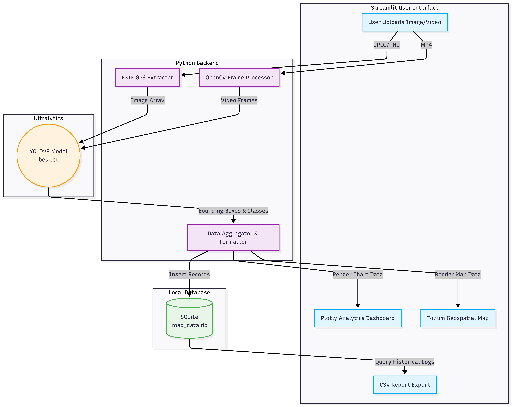

# 🛣️ Automated Infrastructure & Road Damage AI Mapper


An enterprise-grade, full-stack Machine Learning application designed to automate municipal road inspections. Built using YOLOv8 for real-time object detection and Streamlit for geospatial analytics, this system identifies road degradation (potholes, cracks) from dashcam video or imagery and plots the exact coordinates on an interactive map.

**Developed by Iram Anwer** during the ITSOLERA Computer Vision Internship.

---

## ✨ Key Features
* **Real-time AI Vision:** Processes both static `.jpg` images and `.mp4` dashcam video feeds frame-by-frame using YOLOv8.
* **Geospatial Mapping (GIS):** Extracts EXIF metadata to plot detected damage on an interactive density heatmap using `Folium`.
* **Data Analytics & Export:** Generates automated issue-distribution charts via `Plotly` and allows one-click CSV report exports via `Pandas`.
* **Historical Data Persistence:** Logs every detected anomaly into a permanent `SQLite` database to track infrastructure decay over time.

---

## 🏗️ System Architecture & Workflow



1. **Data Ingestion:** User uploads a survey file. System checks for EXIF GPS data; if absent, defaults to a localized simulation matrix (Nawabshah region).
2. **Inference Engine:** YOLOv8 analyzes frames against the user-defined confidence threshold.
3. **Data Pipeline:** Detections are serialized, appended with timestamps, and committed to the local `road_data.db` SQLite database.
4. **Visualization:** Data is routed simultaneously to the Folium Map Layer, the AI Verification Image rendering, and the Plotly Analytics engine.

---

## 🛠️ Technology Stack
* **Computer Vision:** `ultralytics` (YOLO), `opencv-python`, `Pillow`
* **Web Framework:** `streamlit`
* **Geospatial/Mapping:** `folium`, `streamlit-folium`
* **Data Science & Analytics:** `pandas`, `numpy`, `plotly`
* **Database:** `sqlite3`

---

## 🚀 Installation & Local Execution

### 1. Clone the Repository
```
bash
git clone https://github.com/IramAnweArain/Road-Damage-Mapping.git
cd Road-Damage-Mapping
```

### 2. Set Up Virtual Environment
```
bash
python -m venv venv
# Windows:
.\venv\Scripts\activate
```

### 3. Install Dependencies
```
bash
pip install -r requirements.txt
```

### 4. Run the Application
```
bash
streamlit run app.py
```

This project was engineered to demonstrate end-to-end Machine Learning deployment, from model training to cloud hosting and database management.
